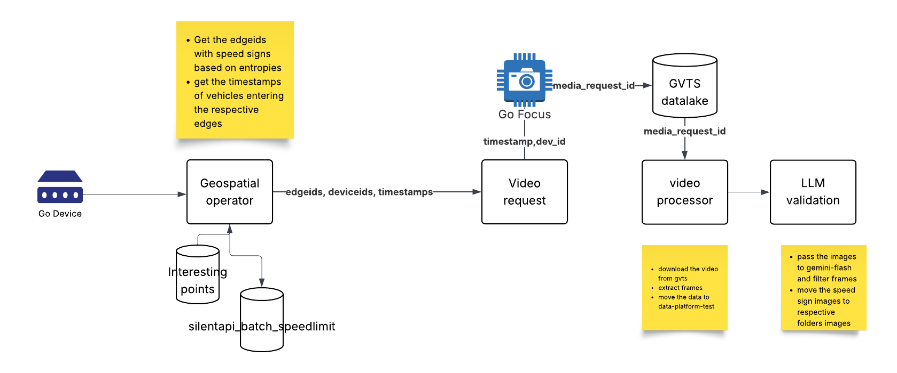

# Speed-limit-map
Detect possible edges with speed limit using entropy scores and then pull videos and run CV models to verify

# Results

# Speed Limit Video Event Detection Pipeline

A production-ready pipeline to detect and validate **speed limit signs** from vehicle-mounted cameras using **geospatial triggers**, **asynchronous video pulls**, and **LLM-based visual validation**. This repo includes the functional architecture, data model, and operational guidance to reproduce the system end-to-end.

## Overview

This system identifies candidate moments where vehicles likely passed **speed-limit signage**, pulls short clips around those moments, samples frames, and validates them using an **LLM vision model**. The pipeline is robust to connectivity variability and optimizes bandwidth by batching requests and sampling frames at a fixed stride.

## Architecture at a Glance

- **Geospatial Operator**: Finds vehicle events near speed-limit edges in a selected region, filtered by an entropy-based likelihood of sign presence.
- **Batch Event Table**: Persists candidate `(device, timestamp)` pairs. Prevents duplicates and supports eventual consistency across runs.
- **Video Request Pipeline**: Submits 15s video requests for devices currently online via the SilentAPI; logs request metadata.
- **Video Processor**: Downloads videos, samples frames (e.g., every 20th), and stores sampled images for inference.
- **LLM Validation**: Runs a vision model over sampled frames to predict the **speed limit**. Majority vote produces the final event label; a representative frame is stored for review/retraining.

## End-to-End Flow

1. **Geospatial Operator (Daily + recurring)**  
   - Fetch tenant vehicles.  
   - Select **edges** (road segments) with likely speed-limit signage using **entropy-based filtering**.  
   - Extract timestamps when vehicles entered those edges for a given date.  
   - Store events in `events_batch` to deduplicate work and support eventual consistency.

2. **Video Requesting & Logging (Every 3 hours)**  
   - Identify online devices.  
   - For each unprocessed `(device, timestamp)` in `events_batch`, request a **15s clip** via SilentAPI.  
   - Mark batch items processed; persist metadata in `speedlimit_log`: `WayId`, `EdgeId`, `media_request_id`, `partner_device_id`, `video_url`, etc.  
   - Update `device_bandwidth` to track retrieval cost/usage per device.

3. **Video Processing**  
   - Download pending clips from `speedlimit_log`.  
   - **Frame sampling**: extract every 20th frame (tunable).

4. **LLM-Based Validation**  
   - Infer on all sampled frames; if no sign, output `-1`.  
   - **Majority vote** across frames → final speed limit prediction.  
   - Persist the final label and the **representative frame** (the one matching the majority class).

## Data Model

- **`events_batch`**: planned requests for `(device_id, timestamp)`; acts as a buffer and deduplication layer.  
- **`speedlimit_log`**: lifecycle of each requested clip, including metadata, retrieval status, and LLM results.  
- **`device_bandwidth`**: per-device retrieval time/cost tracking for quotas/analytics.

## Scheduling

- A recurring DAG runs **every 3 hours**.  
- The **first run of the day** executes the geospatial sweep and writes to `events_batch`. Subsequent runs focus on **online-device** pulls and processing.

## Entropy Heuristic (Sign-Likelihood)

Use **Shannon entropy** over discretized speed categories (e.g., *Slow/Medium/Fast*) within a road segment or node to prioritize edges where **speed-limit transitions** are more likely to occur. Normalize entropy to `[0,1]` to compare across segments; higher entropy can indicate **more varied speeds**, suggesting potential sign changes or inconsistent driving speeds.

## Inference & Label Policy

- The LLM vision model outputs either a **numeric speed** (e.g., `40`, `60`, `100`) or **`-1`** (no sign).  
- Majority voting is computed across sampled frames per clip.  
- Store: `(final_label, representative_frame_path)` in `speedlimit_log`.

